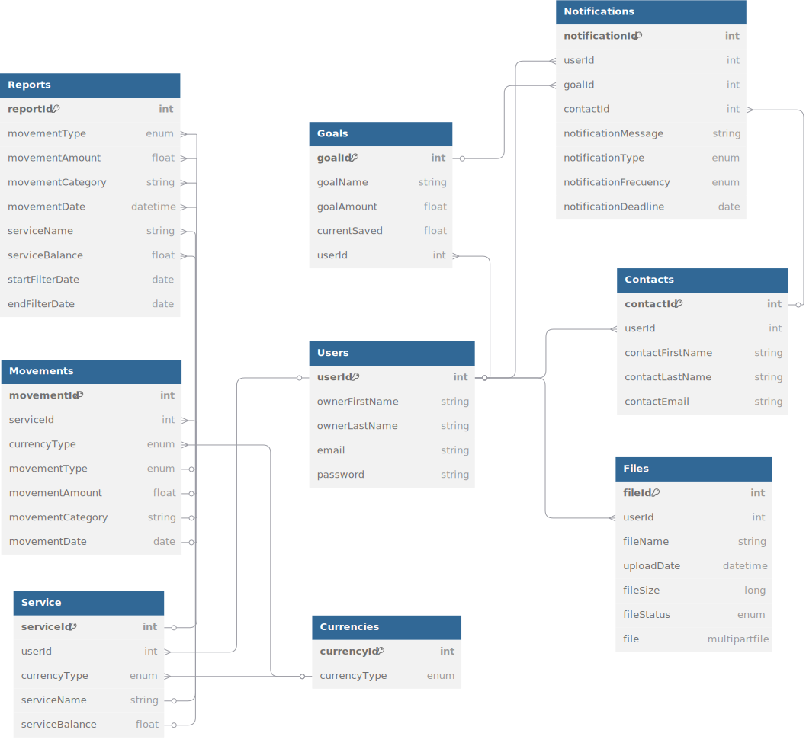

## FinalStatement - FinanCello

**FinalStatement** es una startup fundada por estudiantes de la Universidad Peruana de Ciencias Aplicadas (UPC), con el objetivo de brindar soluciones tecnológicas innovadoras en el ámbito financiero. Nuestra misión es empoderar a las personas para que gestionen sus finanzas de manera eficiente, accesible y personalizada.

## FinanCello
**FinanCello** es el producto principal de FinalStatement: una plataforma orientada a la gestión de finanzas personales. Está diseñada para ayudar a los usuarios a llevar un control claro de sus ingresos, egresos, metas de ahorro y reportes financieros, promoviendo la toma de decisiones inteligentes y el bienestar económico a largo plazo.

### Colaboradores del Proyecto

| **Nombre**                    | **Rol**                                     | **Perfil**                                                 |
|-------------------------------|---------------------------------------------|------------------------------------------------------------|
| Quino Neff Liam Mikael | Project Manager | [LinkedIn](https://www.linkedin.com/in/liam-quino-neff-455891265/)           |
| Bravo Ricapa Leonardo Leoncio | Desarrollador Backend | [LinkedIn](https://www.linkedin.com/in/leonardo-bravo-4120b8228/)           |
| Anaya Vadillo Nathaly Eliane | Tester | [LinkedIn]()           |
| Ticona Apaza María Fernanda Camila |  | [LinkedIn]()           |
| Vera Castellón Mauricio Eduardo | Desarrollador Frontend  | [LinkedIn](https://www.linkedin.com/in/mauricio-c-616227b0/)           |
| Timana Mendoza Sebastián |  | [LinkedIn]()           |

### Revisa el Progreso del Proyecto FinanCello

| **Columna**    | **Descripción**                                                                                                                                    |
|----------------|----------------------------------------------------------------------------------------------------------------------------------------------------|
| **Backlog**    | Contiene todas las historias de usuario, tareas y características que deben desarrollarse. Es el listado de todo el trabajo pendiente.              |
| **In Process** | Incluye las tareas que están actualmente en desarrollo. Visualiza el trabajo en curso para asegurar el flujo continuo de trabajo.                   |
| **In Review**  | Después de completar una tarea, se mueve aquí para una revisión de código y revisión por pares (peer review). Esta fase incluye la creación de **pull requests** para asegurar que el código cumpla con los estándares de calidad antes de integrarse al proyecto principal. |
| **Done**       | Las tareas completamente desarrolladas, revisadas y probadas se mueven aquí, indicando que están listas y finalizadas.                               |

Mira cómo va avanzando nuestro trabajo visitando el siguiente enlace: [Tablero de Trello](https://trello.com/b/2moNd9PE/finanzas-personales).

## Diagramas de la Aplicación

Para entender mejor la estructura y diseño de la aplicación "FinanCello", revisa los siguientes diagramas:

### Diagrama de Clases

Este diagrama nos ayudan a entender cómo funciona el sistema, cómo se comporta y cómo se relacionan sus partes.

### Diagrama de Base de Datos

Este diagrama ilustra el esquema de la base de datos utilizada por la aplicación, mostrando las tablas, columnas, y relaciones entre las entidades.

### Descripción de Capas del Proyecto

| Capa         | Descripción                                                                                   |
|--------------|-----------------------------------------------------------------------------------------------|
| API (Controller) | Contiene los controladores REST que gestionan las solicitudes HTTP y devuelven respuestas al cliente. |
| DTO           | Define los objetos de transferencia de datos utilizados para comunicar distintas capas sin exponer las entidades directamente. |
| Model (Entity) | Contiene las clases que representan el modelo de datos, directamente vinculadas a las tablas de la base de datos. |
| Model (Enum)  | Incluye los enumerados usados en el sistema, como tipos de transacción, categorías, roles, etc. |
| Repository    | Proporciona las interfaces para realizar operaciones CRUD sobre las entidades mediante Spring Data JPA. |
| Service       | Define la lógica de negocio y las operaciones del sistema, sirviéndose de los repositorios. |
| Integration   | Contiene la lógica para integraciones externas, como envío de correos o conexión con APIs bancarias. |
| Mapper        | Implementa los mapeos entre entidades y DTOs (o viceversa), utilizando herramientas como MapStruct o conversiones manuales. |
| Exception     | Maneja las clases de excepciones personalizadas y el control global de errores. |
| Security      | Contiene la configuración y lógica de seguridad, como filtros, autenticación JWT, y reglas de autorización. |
| Config        | Incluye las clases de configuración general del sistema, beans personalizados y settings de entorno. |
